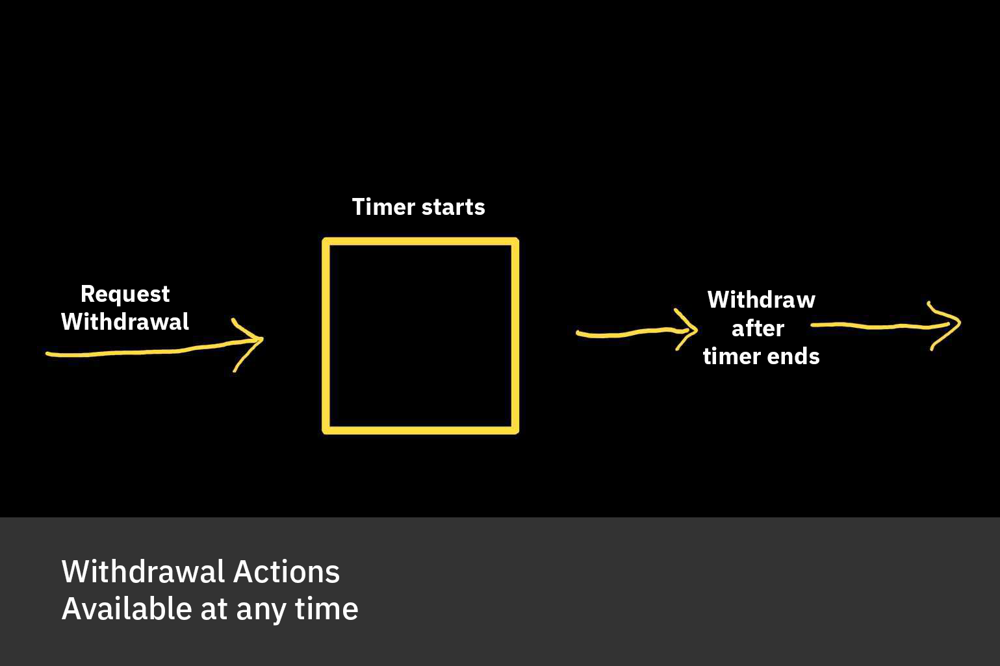
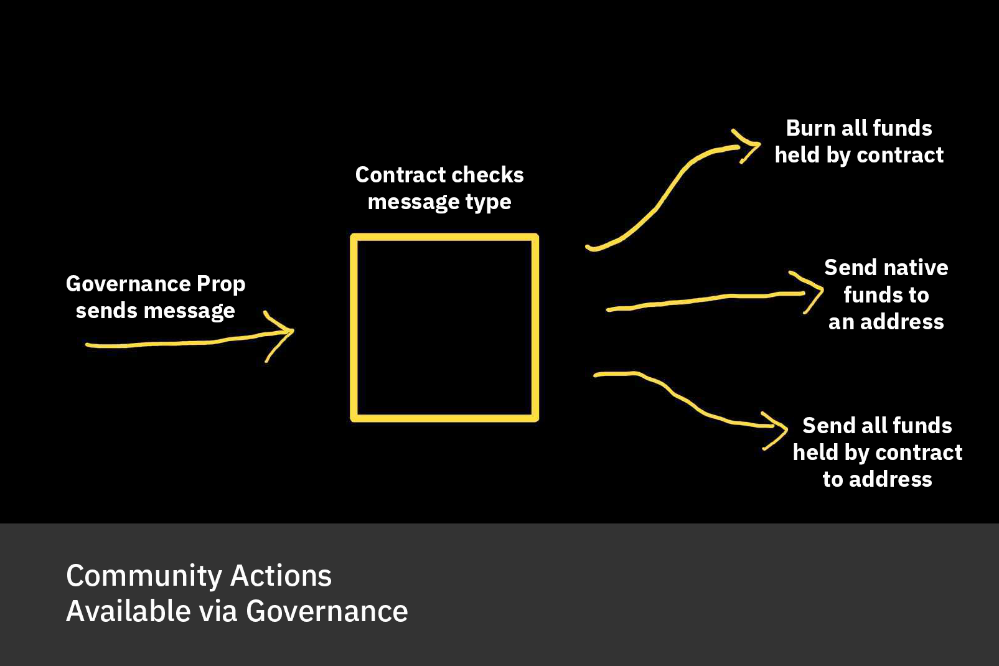

# cw-unity-prop

A CosmWasm Smart Contract to implement the Juno Unity Prop.

For information on verifying the on-chain smart contract, see [VERIFYING.md](./VERIFYING.md).

## Developing

Develop features and write unit tests.

Before committing, run `./scripts/check.sh`.

## Structure

The contract assumes a low-trust environment where the `withdrawal_address` might want to withdraw their funds.

However, there is a configurable delay to do so.

The governance module, meanwhile, can take several actions immediately, using the `sudo` functionality in CW.

This exposes an entrypoint that can _only_ be used by governance.

This means that any arbitrary vesting or release schedule can be executed via governance, if an agreement is reached.

### Withdraw

The `withdraw_address` has only one action available, on a timer:

This is implemented via two messages:

1. The first initiates a withdrawal
2. The second claims a withdrawal, if available

### Governance

Governance has three actions available. All three are executed without delay:

1. Burn all funds held by the contract
2. Send x quantity of native funds held by the contract
3. Send all funds held by the contract

